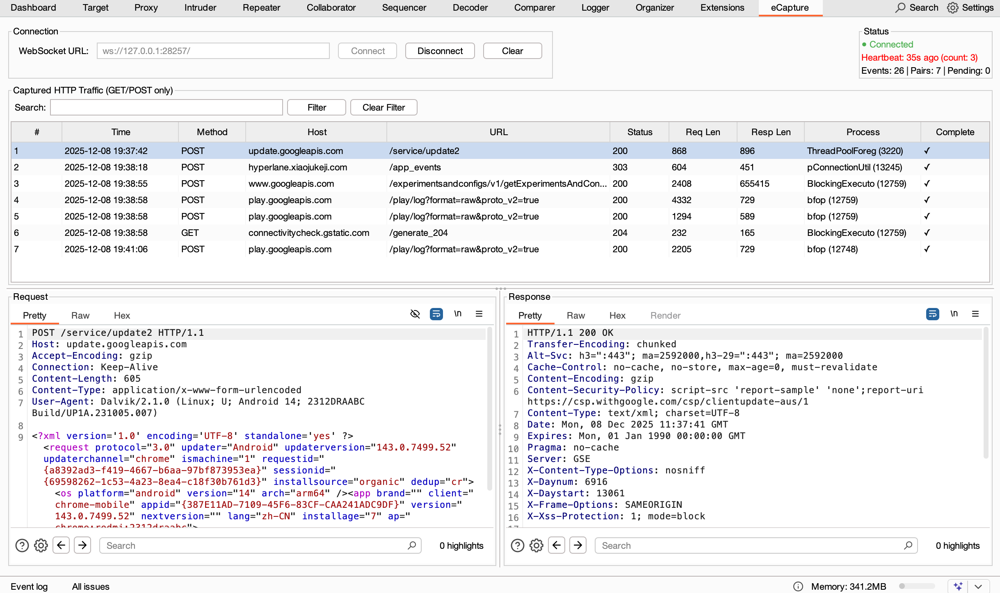

# eCapture Burp Suite Extension

English | [中文](README_CN.md)

A Burp Suite extension for receiving TLS/HTTP traffic data captured by [eCapture](https://github.com/gojue/ecapture).



## Build

```bash
cd eCaptureBurp
./gradlew jar
```

## Usage

### 1. Start eCapture

```bash
sudo ./ecapture tls --ecaptureq=ws://127.0.0.1:28257/
```

### 2. Connect in Burp Suite

1. Enter WebSocket URL (default `ws://127.0.0.1:28257/`)
2. Click **Connect** button
3. Green status indicator means connected

## Configuration

| Parameter | Default | Description |
|-----------|---------|-------------|
| WebSocket URL | `ws://127.0.0.1:28257/` | eCapture eCaptureQ service address |

## Architecture

```
┌─────────────────┐     WebSocket + Protobuf     ┌──────────────────┐
│    eCapture     │ ───────────────────────────> │  Burp Extension  │
│  (eBPF capture) │                              │                  │
└─────────────────┘                              │  ┌────────────┐  │
                                                 │  │ Event Mgr  │  │
                                                 │  │  (pairing) │  │
                                                 │  └─────┬──────┘  │
                                                 │        │         │
                                                 │  ┌─────▼──────┐  │
                                                 │  │ Site Map   │  │
                                                 │  │ + Tab UI   │  │
                                                 │  └────────────┘  │
                                                 └──────────────────┘
```

## License

Apache License 2.0

## Links

- [eCapture Project](https://github.com/gojue/ecapture)
- [eCapture Event Forward API](https://github.com/gojue/ecapture/blob/master/docs/event-forward-api.md)
- [Burp Suite Montoya API](https://portswigger.github.io/burp-extensions-montoya-api/)
